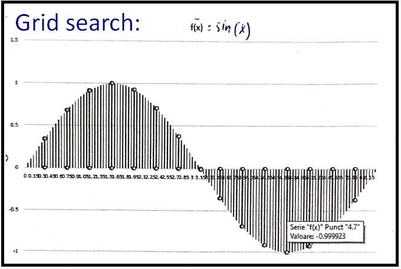
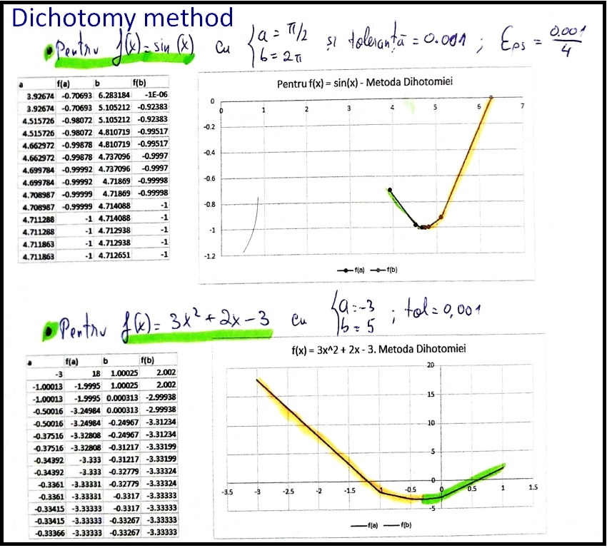
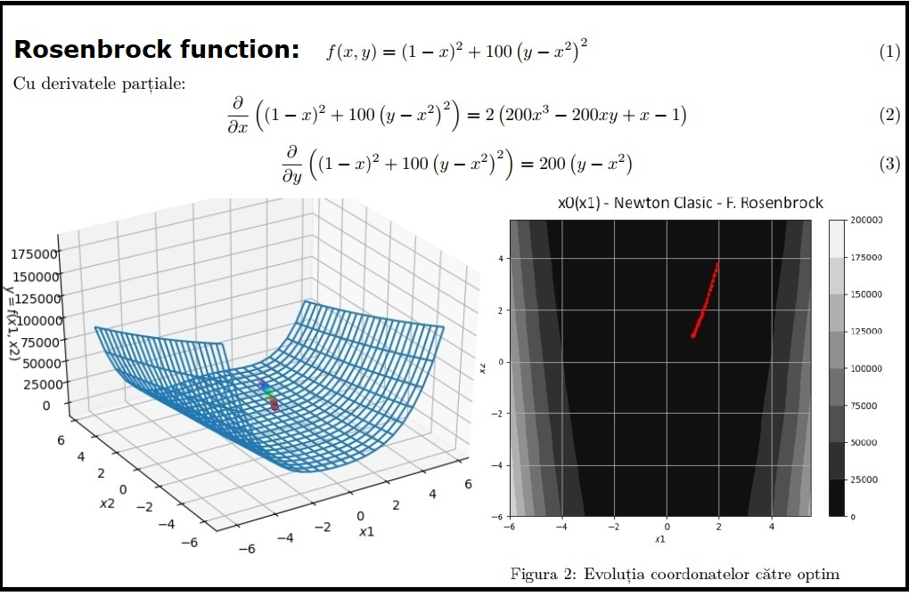

# Optimization-Algorithms-Find-local-minimum
Multiple C/C++ optimization algorithms (derivative and derivative-free optimization) for finding the local minimum of an objective function (cost function). Algorithms: Grid-Search, Pattern-Search, Golden-Ratio, Gradient Descent, Newton, Quasi-Newton, Cauchy/Steepest Descent.

All the algorithms were written and documented by me. The graphs were made using Matplotlib module in Python, while reading the data points from .CSV files (.csv files were generated within the C/C++ algorithms).

# One-Dimensional Derivative-Free Algorithms

## Grid-Search (1D Derivative-Free)
The algorithm goes through all the samples (all the values of the cost function) and stores the lowest value found.

## Dichotomy method / Bisection Algorithm (1D Derivative-Free)
The algorithm starts with a large interval, and then successively reduces the size of the interval until it brackets the root.

## The Golden Ratio method (1D Derivative-Free)
Same as the Dichotomy method, but the cuts are chosen in relation to the golden ratio (1+sqrt(5))/2 = 1.618.

# One-Dimensional Derivative Algorithms

## Gradient Descent (1D First Order Derivative Algorithm)
Gradient descent is a first-order iterative optimization algorithm for finding a local minimum of a differentiable function. It starts with a chosen starting point and moves in the given direction of the derivative with the changed sign

## Newton method (1D Second Order Derivative Algorithm)
Newton's method can conceptually be seen as a steepest descent method. Newton's method uses curvature information (i.e. the second derivative) to take a more direct route.

## Secant method (1D First Order Derivative Algorithm)
Same as Newton's method, but it uses the previous point (stored in a variable) to approximate the 2nd derivative.

# Two-Dimensional Derivative-Free Algorithms

## Direct Search (2D Derivative-Free)
- Choose a set of directions (a non-negative base) 
- Choose an initial alpha step and a starting point (x0 x1)
- Calculate samples from each direction (X_new = X_current + step, where step = alpha\*direction)
- Check if value of cost function is decreasing. If not, decrease the step size (by half).

## Coordinate Search (2D Derivative-Free)
Same as Direct Search but the size of the step is chosen using a one-dimensional (1D) optimization algorithm.

# Two-Dimensional Derivative Algorithms

## Gradient Descent (2D First Order Derivative Algorithm)

## Cauchy / Steepest Descent (2D First Order Derivative Algorithm for quadratic functions)
We wanb to find the best direction for cost function to decrease (residual value) which is equal to the negative gradient:
- Choose a starting point x (x is a 2-dimensional vector)
- Compute the residual value r(x) = -grad f(x)
- Compute the optimum step using a 1D optimization algorithm: step = arg min(f(x) + lambda\*r(x))
- Move with the step = lambda\*r: such as x = x + lambda\* r

## Conjugate Gradients (2D First Order Derivative Algorithm for quadratic functions)
Same as Cauchy method, but the convergence speed is improved by removing the advance on orthogonal directions (zig-zag), by using other search directions such as conjugate directions.

## Classic Newton method (2D Second Order Derivative Algorithm for non-quadratic functions)
- Choose a starting point x (x is a 2-dimensional vector)
- Compute the gradient g(x) and the hessian matrix H(x) in that point
- Move forward with x = x -(H(x))^-1\*g(x)
For quadratic cost funcion, the optimum is found in a single iteration.

## Quasi-Newton method (2D Second Order Derivative Algorithm for non-quadratic functions)
Instead of computing the inverse hessian matrix, we use an approximation of it in order to avoid memory and processor overload.
To approximate the Hessian inverse, we use the Davidon-Fletcher-Powell estimation.

